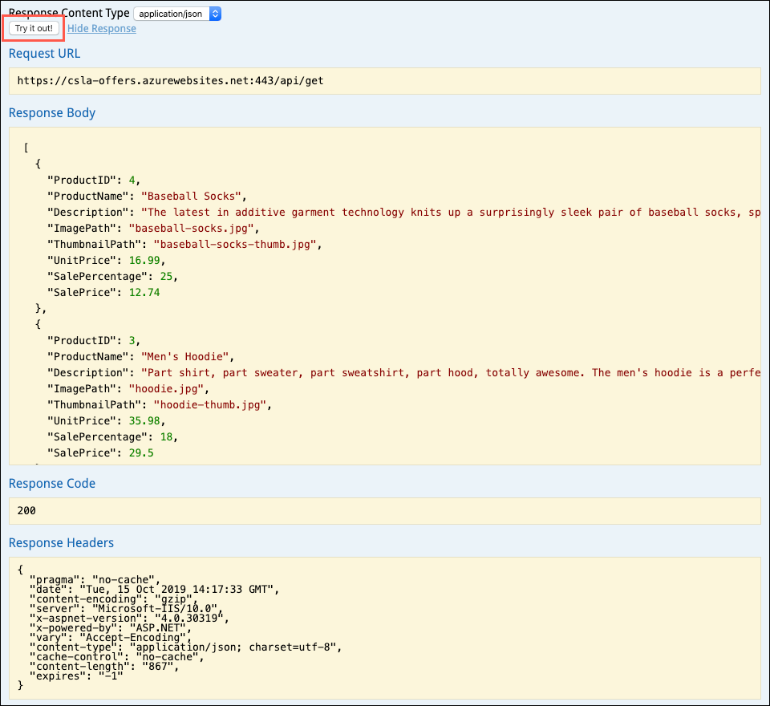

# CloudCore MBA workshop hands-on lab step-by-step guide

October 2019

Information in this document, including URL and other Internet Web site references, is subject to change without notice. Unless otherwise noted, the example companies, organizations, products, domain names, e-mail addresses, logos, people, places, and events depicted herein are fictitious, and no association with any real company, organization, product, domain name, e-mail address, logo, person, place or event is intended or should be inferred. Complying with all applicable copyright laws is the responsibility of the user. Without limiting the rights under copyright, no part of this document may be reproduced, stored in or introduced into a retrieval system, or transmitted in any form or by any means (electronic, mechanical, photocopying, recording, or otherwise), or for any purpose, without the express written permission of Microsoft Corporation.

Microsoft may have patents, patent applications, trademarks, copyrights, or other intellectual property rights covering subject matter in this document. Except as expressly provided in any written license agreement from Microsoft, the furnishing of this document does not give you any license to these patents, trademarks, copyrights, or other intellectual property.

The names of manufacturers, products, or URLs are provided for informational purposes only and Microsoft makes no representations and warranties, either expressed, implied, or statutory, regarding these manufacturers or the use of the products with any Microsoft technologies. The inclusion of a manufacturer or product does not imply endorsement of Microsoft of the manufacturer or product. Links may be provided to third party sites. Such sites are not under the control of Microsoft and Microsoft is not responsible for the contents of any linked site or any link contained in a linked site, or any changes or updates to such sites. Microsoft is not responsible for webcasting or any other form of transmission received from any linked site. Microsoft is providing these links to you only as a convenience, and the inclusion of any link does not imply endorsement of Microsoft of the site or the products contained therein.

© 2019 Microsoft Corporation. All rights reserved.

Microsoft and the trademarks listed at <https://www.microsoft.com/en-us/legal/intellectualproperty/Trademarks/Usage/General.aspx> are trademarks of the Microsoft group of companies. All other trademarks are property of their respective owners.

**Contents**:

- [CloudCore MBA workshop hands-on lab step-by-step guide](#cloudcore-mba-workshop-hands-on-lab-step-by-step-guide)
  - [Abstract and learning objectives](#abstract-and-learning-objectives)
  - [Overview](#overview)
  - [Solution architecture](#solution-architecture)
  - [Exercise 1: Review the e-commerce website](#exercise-1-review-the-e-commerce-website)
    - [Task 1: Explore the e-commerce website](#task-1-explore-the-e-commerce-website)
    - [Task 2: Inspect the Offers REST API](#task-2-inspect-the-offers-rest-api)
    - [Task 2: Sign in to the site](#task-2-sign-in-to-the-site)
    - [Task 3: Submit an order](#task-3-submit-an-order)
    - [Exercise 1 challenge questions](#exercise-1-challenge-questions)
  - [Exercise 2: Review Call Center Admin app](#exercise-2-review-call-center-admin-app)
    - [Exercise 2 challenge questions](#exercise-2-challenge-questions)
  - [Exercise 3: Review security configuration](#exercise-3-review-security-configuration)
    - [Task 1: Inspect Web App settings](#task-1-inspect-web-app-settings)
  - [Exercise 3: Explore database features](#exercise-3-explore-database-features)
    - [Task 1: Automatic failover groups](#task-1-automatic-failover-groups)
    - [Task 2: Data Classification and Discovery](#task-2-data-classification-and-discovery)
    - [Task 3: Vulnerability Assessment](#task-3-vulnerability-assessment)
    - [Exercise 3 Challenge questions](#exercise-3-challenge-questions)
  - [Exercise 4: Automating back-end processes with serverless computing](#exercise-4-automating-back-end-processes-with-serverless-computing)
    - [Task 1: Logic Apps](#task-1-logic-apps)
    - [Task 2: Azure Functions](#task-2-azure-functions)
    - [Task 3: Azure Storage account](#task-3-azure-storage-account)
  - [Help references](#help-references)

## Abstract and learning objectives

In this hands-on lab, you take a more in-depth look at an end-to-end e-commerce solution running on platform-as-a-service (PaaS) services in Azure. The exercises below step you through running the deployed web applications and reviewing the underlying Azure services. You can complete the lab on your own, but it is highly recommended to pair up with additional team members. Working with others more closely models a real-world experience, and allows members to share their expertise for the overall solution.

At the end of this hands-on lab, you will have a better understanding of the customer value delivered by Microsoft Azure.

## Overview

The Contoso Sports League Association (CSLA) runs a highly successful e-commerce website that sells merchandise to their legions of fans. They host the website and its associated services in a co-location facility near their corporate headquarters. The success of their website has placed a heavy burden on their already overwhelmed IT staff. As the site has grown, the amount of time and money they are spending on infrastructure and database management has increased drastically. Also, they recently suffered two major service outages. The first one was caused by cut fiber lines, which took its database offline for over five hours. The other was the result of a regional power outage that took everything offline. These outages cost them tens of thousands of dollars in lost revenue.

They have approached Microsoft to gain a better understanding of what would be involved in migrating their entire website into the cloud. They are interested in learning more about the platform-as-a-service (PaaS) offerings in Azure. They believe PaaS might be able to help alleviate some of their infrastructure management issues while simultaneously providing a more highly-available solution. They have observed that Azure has received numerous compliance certifications, including PCI, and are interested in moving their solution to Azure. CSLA CEO Miles Strom has stated, "we are spending more engineering time on infrastructure and less on the experience that matters most to our fan base." They believe migrating to the cloud can help them to refocus their efforts on delivering business value by releasing new and improved products and services.

A team of Microsoft Cloud Solution Architects (CSAs) has designed a proposed architecture and built a prototype solution. They intend to use this solution to demonstrate to Contoso how their website and its associated services can quickly and easily migrate into Azure. They have requested assistance in better defining the value proposition for each component of their proposed solution in their customer presentation.

## Solution architecture

Below is a diagram of the solution architecture implemented by the CSA team. Please study this carefully, so you understand the whole of the solution as you are working on the various components.

From a high-level, they have Web Apps hosting the e-commerce and call center websites, API Apps hosting web services, and Logic Apps hosting integration with SMS. Azure Traffic Manager handles routing to the appropriate region for high availability. The Web and API Apps are hosted within an Internal Load Balanced (ILB) App Service Environment (ASE). The ASE enables them to take advantage of network security groups to lock down inbound and outbound communication to the App Services it hosts. A Web Application Firewall (WAF) provided by an Azure App Gateway is hosted in an isolated subnet secured by network security groups. Internet traffic flows through the WAF to the e-commerce website (hosted within the ASE), which only allows inbound traffic from the WAF. When customers visit the website, they see offers that come from the Offers Service REST API hosted within an API App. Orders come in from customers via the publicly accessible endpoint of the e-commerce website. Credit card validation is part of the checkout process, using a third-party payment gateway. Once authorized and payment is captured, the order data is written to the orders Azure SQL Database, and the inventory lookup message is sent to the Inventory Lookup queue. An Azure Function hosts the process of creating PDF receipts for customer purchases. Customers are notified via SMS as their order is processed. This process involves a process running in a Logic App that integrates the SQL DB with a third-party solution for sending SMS text messages.

Inventory lookup requests are queued from the e-commerce website to the queue in Azure Storage queues. The on-premises inventory app reads from this queue to kick off its internal lookup processes and writes the status back to the orders database.

Call center operators access the call center website, which, owing to the network security groups configured, is only available across the virtual private network (VPN) connection.

> **Note**: The above solution is only one of many possible, viable approaches.

## Exercise 1: Review the e-commerce website

We will start this hands-on lab by taking some time to explore the deployed web applications and review the implementation provided by the Microsoft CSA team. In this exercise, you will launch the e-commerce website and explore the functionality implemented by the Microsoft CSA team. You will log into the website using Azure Active Directory B2C and place an order for a product.

TODO: Finish this description, including more details around the value prop of using App Services

### Task 1: Explore the e-commerce website

In this task, you will launch the e-commerce website and explore the functionality implemented by the Microsoft CSA team.

1. In a web browser, open the Contoso Sports League Association's e-commerce web site by navigating to <https://csla.azurewebsites.net>.

   

2. On the home page, take a moment to look around, and note the **Today's Offers** section. The products listed here are retrieved from the Offers API and loaded asynchronously onto the page.

   

   > **Note**: You will look further into the Offers API in the next task. TODO: Add more here about why using an async API is beneficial.

3. Select **Product Details** for one of the products in the **Today's Offers** section.

   

4. The details page allows you to see more specific information about individual products, as well as a few related products.

   

5. Navigate to the [Store page](https://contososportsleague.azurewebsites.net/Store) by selecting **Store** from the top menu bar.

   

6. The Store page provides a list of all the products offered on the website. These are pulled directly from the `Products` table in the ContosoSports database.

### Task 2: Inspect the Offers REST API

Let's quickly look at how offers are retrieved from the database and served to the frontend web application. In this task, you will look at the Offers REST API endpoint, and use [Swagger UI](https://swagger.io/tools/swagger-ui/) to see the results of calling the API.

> The Microsoft team added Swagger UI into Contoso's Offers API to allow easy visualization and interaction with the API's resources. Swagger UI allows this functionality without having any of the implementation logic in place. It’s automatically generated from the OpenAPI Specification, with the visual documentation making it easy for backend implementation and client side consumption.

The Offers API selects up to three random products from the `Products` table, and presents them to users on the home page of the e-commerce site.

TODO: Reasoning and benefits of using APIs: Loosely coupled, microservices approach... Use of a separate API App allows for...

TODO: Value prop for using this: Saves developers time by allowing them to easily understand an API's definition and test endpoints.

1. In the [Azure portal](https://portal.azure.com), select **Resource groups** from the left-hand menu, and then select the **cloudcore-mba** resource group from the list.

   

2. In a new web browser window or tab, navigate to <https://csla-offers.azurewebsites.net/swagger>.

3. On the Swagger UI page, select **Expand Operations** next to the **Offers** endpoint.

   

4. Within the expanded Offers endpoint, you can observe several crucial pieces of information about using the endpoint.

   - The `GET` keyword tells developers which HTTP verbs are allowed for calling the endpoint, and the path that follows it tells them where the endpoint is located.

     

   - The `Model Schema` provides details about what will be returned when calling the endpoint, so developers can quickly see the object they will get in response.

     

   - The `Response content type` indicates the content type of value returned by the endpoint.

     

5. The **Try it out** functionality offered through the Swagger UI provides the ability to quickly test many API endpoints. To demonstrate this, select the **Try it out!** button and observe the results.

   

6. In the output, examine the **Response Body**, noting the three products that are returned. These products are displayed on the home page of the e-commerce website as **Today's Offers**.

   

### Task 2: Sign in to the site

In this task, you will log into the website using Azure Active Directory B2C and place an order for a product.

TODO: Blurb about Azure AD B2C and the value it provides.

1. In an effort to make their website and user experience more secure, the Microsoft team incorporated Azure Active Directory B2C as part of their prototype solution. Return to the browser window with the open e-commerce site, and select **Sign in** from the top right-hand menu.

   

### Task 3: Submit an order

In this task, you will add a product to your cart and complete an order. This will send payment information to the Payments API, which leverages a third-party payment gateway to handle credit card processing.

1. Submit an order...

### Exercise 1 challenge questions

1. Question about using App Services and the benefits to an organization (no infra management, fast and easy scalability, automatic backups, etc.)
2. How does using Azure AD improve the overall customer experience and site security posture?

## Exercise 2: Review Call Center Admin app

TODO: Add blurb about call center app sitting behind Azure AD...

1. Log in with Azure AD account...
2. Review orders

### Exercise 2 challenge questions

1. How does using Azure AD improve the overall security posture and sign-in process for the Call Center Admin site?
2. What is the impact of using a read-only database connection for viewing orders?
   1. TODO: Need to configure the connection string app settings to use the `ContosoSportsLeagueReadOnly` connection string from Key Vault.

## Exercise 3: Review security configuration

### Task 1: Inspect Web App settings

TODO: Is there any value in using separate web apps for each team, and then allowing them to config the connection to the database and queue using key vault references?
    - This would allow attendees to do some hands-on configuration, but not require any technical skills.
    - Perhaps have them enter the secrets into Key Vault, and then retrieve the secret URI and add it into Key Vault.

In this task, you will review the application settings configuration for the deployed Web App.

**NOTE**: Review security settings, pointing out the use of [Key Vault references](https://docs.microsoft.com/en-us/azure/app-service/app-service-key-vault-references) to quickly add secrets into Key Vault and use them within the application without needing to make any code changes. Talk about Value proposition associated with getting secrets out of config files, and cost savings of not having to make code changes.

## Exercise 3: Explore database features

TODO: Provide summary of high availability features and talk about SQL Server auto-failover groups.

### Task 1: Automatic failover groups

TODO: Add steps to explore failover groups.

### Task 2: Data Classification and Discovery

### Task 3: Vulnerability Assessment

### Exercise 3 Challenge questions

1. What region is the secondary region for the defined failover group?
2. What is the value proposition provided by automatic failover groups? Can organizations get the same functionality without using a cloud provider?

## Exercise 4: Automating back-end processes with serverless computing

Serverless computing enables developers to build applications faster by eliminating the need for them to manage infrastructure. With serverless applications, the cloud service provider automatically provisions, scales, and manages the infrastructure required to run the code. In understanding the definition of serverless computing, it’s important to note that servers are still running the code. The serverless name comes from the fact that the tasks associated with infrastructure provisioning and management are invisible to the developer.

> **Value proposition**: This approach enables developers to increase their focus on the business logic and deliver more value to the core of the business. Serverless computing helps teams increase their productivity and bring products to market faster, and it allows organizations to better optimize resources and stay focused on innovation.

### Task 1: Logic Apps

Without writing any code, you can automate business processes more easily and quickly when you create and run workflows with Azure Logic Apps. Logic Apps provide a way to simplify and implement scalable integrations and workflows in the cloud. It provides a visual designer to model and automate your process as a series of steps known as a workflow. There are [many connectors](https://docs.microsoft.com/en-us/azure/connectors/apis-list) across the cloud and on-premises to quickly integrate across services and protocols.

The advantages of using Logic Apps include the following:

- Saving time by designing complex processes using easy to understand design tools

- Implementing patterns and workflows seamlessly, that would otherwise be difficult to implement in code

- Getting started quickly from templates

- Customizing your logic app with your own custom APIs, code, and actions

- Connect and synchronize disparate systems across on-premises and the cloud

- Build off of BizTalk server, API Management, Azure Functions, and Azure Service Bus with first-class integration support

### Task 2: Azure Functions

Contoso wants to automate the process of generating receipts in PDF format and alerting users when their orders have been processed using Azure Logic App and Functions. To run custom snippets of C\# or node.js in logic apps, you can create custom functions through Azure Functions. [Azure Functions](https://docs.microsoft.com/en-us/azure/azure-functions/functions-overview) offers server-free computing in Microsoft Azure and are useful for performing these tasks:

- Advanced formatting or compute of fields in logic apps

- Perform calculations in a workflow

- Extend the logic app functionality with functions that are supported in C\# or node.js

### Task 3: Azure Storage account

Queues & Blob storage

## Help references

|    |            |
|----------|:-------------|
| **Description** | **Links** |
| SQL firewall | <https://azure.microsoft.com/en-us/documentation/articles/sql-database-configure-firewall-settings/> |
| Deploying a Web App | <https://azure.microsoft.com/en-us/documentation/articles/web-sites-deploy/> |
| Deploying an API app | <https://azure.microsoft.com/en-us/documentation/articles/app-service-dotnet-deploy-api-app/> |
| Accessing an API app from a JavaScript client | <https://azure.microsoft.com/en-us/documentation/articles/app-service-api-javascript-client/> |
| SQL Database Geo-Replication overview | <https://azure.microsoft.com/en-us/documentation/articles/sql-database-geo-replication-overview/> |
| What is Azure AD? | <https://azure.microsoft.com/en-us/documentation/articles/active-directory-whatis/> |
| Azure Web Apps authentication | <http://azure.microsoft.com/blog/2014/11/13/azure-websites-authentication-authorization/> |
| View your access and usage reports | <https://msdn.microsoft.com/en-us/library/azure/dn283934.aspx> |
| Custom branding an Azure AD Tenant | <https://msdn.microsoft.com/en-us/library/azure/Dn532270.aspx> |
| Service Principal Authentication | <https://docs.microsoft.com/en-us/azure/app-service-api/app-service-api-dotnet-service-principal-auth> |
| Consumer Site B2C | <https://docs.microsoft.com/en-us/azure/active-directory-b2c/active-directory-b2c-devquickstarts-web-dotnet> |
| Getting Started with Active Directory B2C | <https://azure.microsoft.com/en-us/trial/get-started-active-directory-b2c/> |
| How to Delete an Azure Active Directory | <https://blog.nicholasrogoff.com/2017/01/20/how-to-delete-an-azure-active-directory-add-tenant/> |
| Run performance tests on your app | <http://blogs.msdn.com/b/visualstudioalm/archive/2015/09/15/announcing-public-preview-for-performance-load-testing-of-azure-webapp.aspx> |
| Application Insights Custom Events | <https://azure.microsoft.com/en-us/documentation/articles/app-insights-api-custom-events-metrics/> |
| Enabling Application Insights | <https://azure.microsoft.com/en-us/documentation/articles/app-insights-start-monitoring-app-health-usage/> |
| Detect failures | <https://azure.microsoft.com/en-us/documentation/articles/app-insights-asp-net-exceptions/> |
| Monitor performance problems | <https://azure.microsoft.com/en-us/documentation/articles/app-insights-web-monitor-performance/> |
| Creating a Logic App | <https://azure.microsoft.com/en-us/documentation/articles/app-service-logic-create-a-logic-app/> |
| Logic app connectors | <https://azure.microsoft.com/en-us/documentation/articles/app-service-logic-connectors-list/> |
| Logic Apps Docs | <https://docs.microsoft.com/en-us/azure/logic-apps/logic-apps-what-are-logic-apps> |
| Azure Functions -- create first function | <https://docs.microsoft.com/en-us/azure/azure-functions/functions-create-first-azure-function> |
| Azure Functions docs | <https://docs.microsoft.com/en-us/azure/logic-apps/logic-apps-azure-functions> |
