# CloudCore MBA workshop hands-on lab step-by-step guide

October 2019

Information in this document, including URL and other Internet Web site references, is subject to change without notice. Unless otherwise noted, the example companies, organizations, products, domain names, e-mail addresses, logos, people, places, and events depicted herein are fictitious, and no association with any real company, organization, product, domain name, e-mail address, logo, person, place or event is intended or should be inferred. Complying with all applicable copyright laws is the responsibility of the user. Without limiting the rights under copyright, no part of this document may be reproduced, stored in or introduced into a retrieval system, or transmitted in any form or by any means (electronic, mechanical, photocopying, recording, or otherwise), or for any purpose, without the express written permission of Microsoft Corporation.

Microsoft may have patents, patent applications, trademarks, copyrights, or other intellectual property rights covering subject matter in this document. Except as expressly provided in any written license agreement from Microsoft, the furnishing of this document does not give you any license to these patents, trademarks, copyrights, or other intellectual property.

The names of manufacturers, products, or URLs are provided for informational purposes only and Microsoft makes no representations and warranties, either expressed, implied, or statutory, regarding these manufacturers or the use of the products with any Microsoft technologies. The inclusion of a manufacturer or product does not imply endorsement of Microsoft of the manufacturer or product. Links may be provided to third party sites. Such sites are not under the control of Microsoft and Microsoft is not responsible for the contents of any linked site or any link contained in a linked site, or any changes or updates to such sites. Microsoft is not responsible for webcasting or any other form of transmission received from any linked site. Microsoft is providing these links to you only as a convenience, and the inclusion of any link does not imply endorsement of Microsoft of the site or the products contained therein.

© 2019 Microsoft Corporation. All rights reserved.

Microsoft and the trademarks listed at <https://www.microsoft.com/en-us/legal/intellectualproperty/Trademarks/Usage/General.aspx> are trademarks of the Microsoft group of companies. All other trademarks are property of their respective owners.

**Contents**:

- [CloudCore MBA workshop hands-on lab step-by-step guide](#cloudcore-mba-workshop-hands-on-lab-step-by-step-guide)
  - [Abstract and learning objectives](#abstract-and-learning-objectives)
  - [Overview](#overview)
  - [Solution architecture](#solution-architecture)
  - [Exercise 1: Review the e-commerce and call center websites](#exercise-1-review-the-e-commerce-and-call-center-websites)
    - [Task 1: Explore the e-commerce website](#task-1-explore-the-e-commerce-website)
    - [Task 2: Inspect the Offers REST API](#task-2-inspect-the-offers-rest-api)
    - [Task 3: Sign in to the site](#task-3-sign-in-to-the-site)
    - [Task 4: Submit an order](#task-4-submit-an-order)
    - [Task 5: View orders in the call center app](#task-5-view-orders-in-the-call-center-app)
    - [Exercise 1 challenge questions](#exercise-1-challenge-questions)
  - [Exercise 2: Review Azure App Services](#exercise-2-review-azure-app-services)
    - [Task 1: Inspect Web App configuration](#task-1-inspect-web-app-configuration)
    - [Task 2: Securing application secrets with Key Vault](#task-2-securing-application-secrets-with-key-vault)
    - [Exercise 2 challenge questions](#exercise-2-challenge-questions)
  - [Exercise 3: Explore database features](#exercise-3-explore-database-features)
    - [Task 1: Inspect auto-failover groups configuration](#task-1-inspect-auto-failover-groups-configuration)
    - [Task 2: Review database vulnerability assessment](#task-2-review-database-vulnerability-assessment)
    - [Task 3: Explore Data Discovery and Classification findings](#task-3-explore-data-discovery-and-classification-findings)
    - [Exercise 3 Challenge questions](#exercise-3-challenge-questions)
  - [Exercise 4: Automating back-end processes with serverless computing](#exercise-4-automating-back-end-processes-with-serverless-computing)
    - [Task 1: Explore the Logic App configuration](#task-1-explore-the-logic-app-configuration)
    - [Exercise 4 challenge questions](#exercise-4-challenge-questions)
  - [Additional resources](#additional-resources)

## Abstract and learning objectives

In this hands-on lab, you take an in-depth look at an end-to-end e-commerce solution running on platform-as-a-service (PaaS) services in Azure. The exercises below step you through running the deployed web applications and then guide you through a review of several important features of the underlying Azure services. You can complete the lab on your own, but it is highly recommended to pair up with additional team members. Working with others more closely models a real-world experience, and allows members to share their expertise for the overall solution.

At the end of this hands-on lab, you will have a better understanding of the value delivered by Microsoft Azure and how it can be leveraged to improve customer solutions.

## Overview

The Contoso Sports League Association (CSLA) runs a highly successful e-commerce website that sells merchandise to their legions of fans. They host the website and its associated services in a co-location facility near their corporate headquarters. The success of their website has placed a heavy burden on their already overwhelmed IT staff. As the site has grown, the amount of time and money they are spending on infrastructure and database management has increased drastically. Also, they recently suffered two major service outages. The first one was caused by cut fiber lines, which took its database offline for over five hours. The other was the result of a regional power outage that took everything offline. These outages cost them tens of thousands of dollars in lost revenue.

They have approached Microsoft to gain a better understanding of what would be involved in migrating their entire website into the cloud. They are interested in learning more about the platform-as-a-service (PaaS) offerings in Azure. They believe PaaS might be able to help alleviate some of their infrastructure management issues while simultaneously providing a more highly-available solution. They have observed that Azure has received numerous compliance certifications, including PCI, and are interested in moving their solution to Azure. CSLA CEO Miles Strom has stated, "we are spending more engineering time on infrastructure and less on the experience that matters most to our fan base." They believe migrating to the cloud can help them to refocus their efforts on delivering business value by releasing new and improved products and services.

A team of Microsoft Cloud Solution Architects (CSAs) has designed a proposed architecture and built a prototype solution. They intend to use this solution to demonstrate to Contoso how their website and its associated services can quickly and easily migrate into Azure. They have requested assistance in better defining the value proposition for each component of their proposed solution in their customer presentation.

## Solution architecture

Below is a diagram of the solution architecture implemented by the CSA team. Please study this carefully, so you understand the whole of the solution as you are working on the various components.


From a high-level, the customer's e-commerce and call center websites are hosted using Web Apps. Each of the public websites is secured using Azure Active Directory (Azure AD). The Offers and Payment Gateway APIs are running in API Apps. Order processing is implemented using various serverless technologies, including Logic Apps, Azure Functions, Azure Storage Queues, and Azure Blob storage. When visiting the e-commerce website, customers are presented with offers that are served from the Offers REST API hosted within an API App. Orders are submitted by customers via the e-commerce website. Credit card validation is part of the checkout process and uses a third-party payment gateway. Once authorized and payment is captured, the order data is written to the orders Azure SQL Database, and the order details are sent to a processing queue. The Logic App is trigger by items being added to the queue. The Logic App triggers an Azure Function to create PDF receipts for customer purchases. Customers are notified via SMS as their order is processed using the [Twilio](https://www.twilio.com/) connector integrated into the Logic App.

> **Note**: The above solution is only one of many possible, viable approaches.

## Exercise 1: Review the e-commerce and call center websites

We start this hands-on lab by taking some time to explore the deployed web applications and review the implementation provided by the Microsoft CSA team. In this exercise, you will launch the e-commerce website and explore the functionality implemented by the Microsoft CSA team. You will log into the website using Azure Active Directory B2C and place an order for a product. Once you've placed an order, you will login into the call center website using Azure Active Directory and review the list of orders, and inspect the details of an order.

The e-commerce and call center websites and Offers and Payments APIs are hosted using Azure App Services. [Azure App Service](https://docs.microsoft.com/en-us/azure/app-service/) is a PaaS service that allows web applications, REST APIs, and mobile back-ends to be hosted in the cloud without the need to manage infrastructure. Applications can be configured to run and scale with ease on both Windows and Linux-based environments. Using App Service, customers gain access to powerful features, such as:

- Security and compliance
- Load balancing
- Auto-scaling
- Automated management
- DevOps capabilities
- Staging environments

### Task 1: Explore the e-commerce website

In this task, you will launch the e-commerce website and explore the functionality implemented by the Microsoft CSA team.

1. In a web browser, open the Contoso Sports League Association's e-commerce web site by navigating to <https://csla.azurewebsites.net>.

   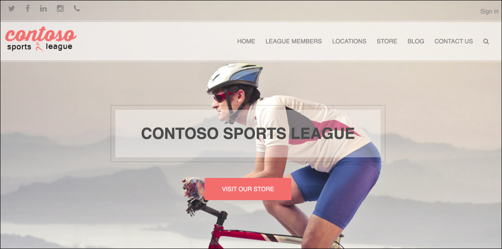

2. On the home page, take a moment to look around, and note the **Today's Offers** section.

   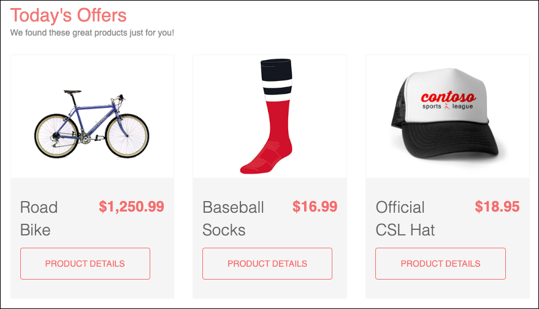

   > **Note**: The products listed here are retrieved from the Offers API and loaded asynchronously onto the page. You will look further into the Offers API in the next task.

3. Select **Product Details** for one of the products in the **Today's Offers** section.

   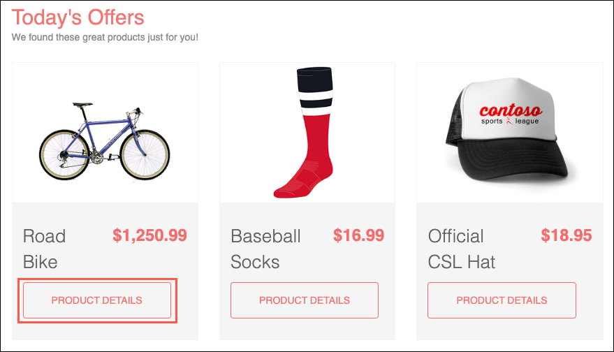

4. The details page allows you to see more specific information about individual products, as well as a few related products.

   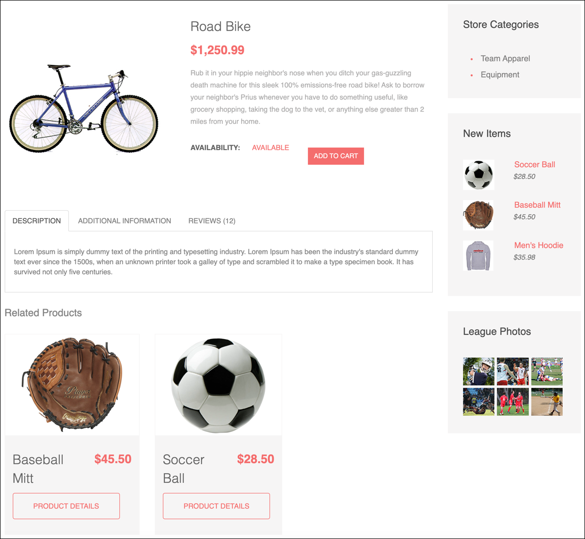

5. Navigate to the [Store page](https://contososportsleague.azurewebsites.net/Store) by selecting **Store** from the top menu bar.

   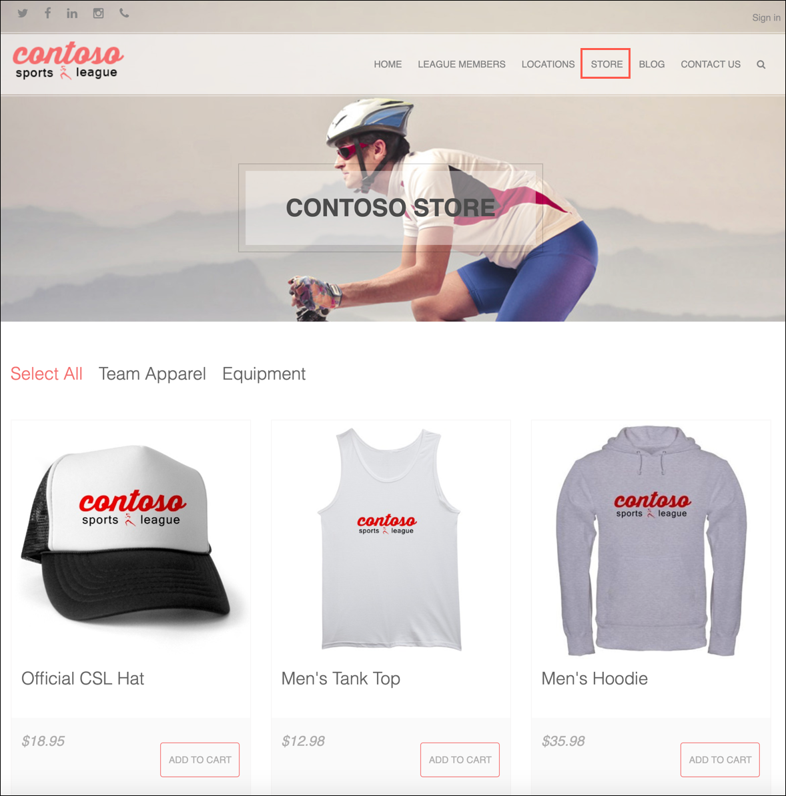

  > **Note**: The Contoso Store page provides a list of all the products offered on the website. This page loads data from the `Products` database table using traditional .NET data access methods, and is tightly coupled in the e-commerce application.

### Task 2: Inspect the Offers REST API

Let's quickly look at how offers are retrieved from the database and served to the frontend web application. In this task, you will look at the Offers REST API endpoint, and use [Swagger UI](https://swagger.io/tools/swagger-ui/) to see the results of calling the API.

The choice was made to deploy the Offers REST API into a stand-alone API App based on a specific customer request. Contoso stated that they anticipated growing the functionality of the Offers API and wanted the capability of growing and scaling that service independently of the e-commerce application. Using the API App Service, Contoso has the ability to scale their API as it grows, and can adjust their spending for the API based on the individual needs of that service.

> The Microsoft team chose to add Swagger UI into Contoso's Offers API to allow easy visualization and interaction with the API's resources. Swagger UI enables this functionality without having any of the implementation logic in place. It’s automatically generated from the OpenAPI Specification, with the visual documentation making it easy for backend implementation and client side consumption.

From a functional standpoint, the Offers API retrieves three random products from the `Products` database table, and returns them to the user interface (UI). On the UI, those products are displayed to users on the home page of the e-commerce site.

1. In a new web browser window or tab, navigate to the Swagger UI page of the Offers API at <https://csla-offers.azurewebsites.net/swagger>.

2. On the Swagger UI page, select **Expand Operations** next to the **Offers** endpoint.

   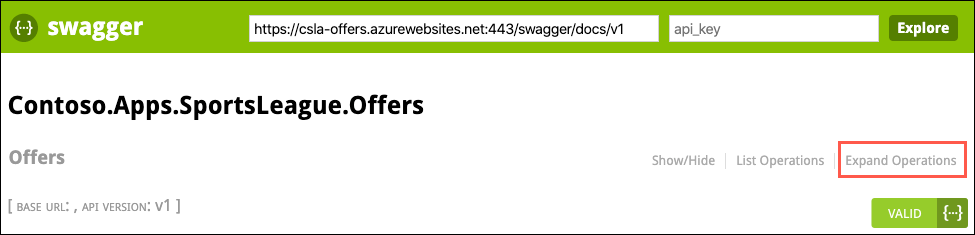

3. Within the expanded Offers endpoint, you can observe several crucial pieces of information about using the endpoint.

   - The `GET` keyword tells developers which HTTP verbs are allowed for calling the endpoint, and the path that follows it tells them where the endpoint is located.

     

     > **Note**: An important point to note is that the Offers API currently only offers `GET` functionality. This means that all data requests coming from the API are only reading data. There are not methods that allow modifications to the underlying data. To provide an added layer of security and isolation, the Offers API was implemented using functionality called Read scale-out. Using Read scale-out, the database connection is pointed to a read-only secondary database. This allows queries to be made without impacting the performance of the primary database. Using a read-only secondary database connection provides an added layer of security by ensuring that connections coming from the the API cannot be used to insert, update, or delete data in the database.

   - The `Model Schema` provides details about what will be returned when calling the endpoint, so developers can quickly see the object they will get in response.

     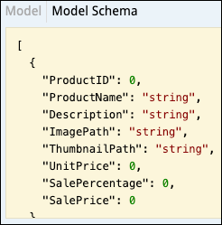

   - The `Response content type` indicates the content type of value returned by the endpoint.

     

4. The **Try it out** functionality offered through the Swagger UI provides the ability to quickly test many API endpoints. To demonstrate this, select the **Try it out!** button and observe the results.

   

5. In the output, examine the **Response Body**, noting the three products that are returned. These products are displayed on the home page of the e-commerce website as **Today's Offers**.

   

### Task 3: Sign in to the site

To make the e-commerce website and user experience more secure, the Microsoft team incorporated [Azure Active Directory B2C](https://azure.microsoft.com/en-us/services/active-directory-b2c/) as part of their prototype solution. Azure Active Directory B2C provides business-to-customer identity as a service, which allows customers to add identity and access management to customer-facing applications easily. It is built on the Azure AD identity platform, and provides:

- Strong authentication for your customers
- Integration with apps and databases to capture sign-in and conversion data
- Branded registration and sign-in screens for a white-label experience
- Built-in templates to add registration and sign-in functionality to apps quickly

In this task, you will register for and log into the e-commerce website.

1. Return to the browser window with the open e-commerce site, and select **Sign in** from the top right-hand menu.

   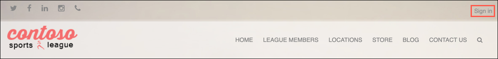

2. On the **Sign in** page, select the **Sign up now** link to create an account for logging into the site.

   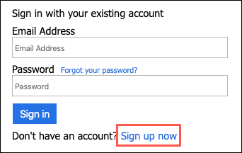

3. On the **Sign up** page, enter the following:

   - **Email Address**: Enter an email address you can access for retrieving the verification code.
   - **Send verification code**: Select this, and then open the email account you used in the field above and retrieve the verification code. Enter the verification code into the field that appears and then select **Verify code**.
   - **New Password**: Enter a password.
   - **Confirm New Password**: Reenter the password you used above.
   - **Country/Region**: Select United States, or another country if you prefer.
   - **Display Name**: Enter a display name for your account.
   - **Postal Code**: Enter 23456.

   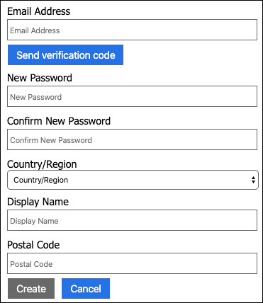

4. Select **Create** to create your account and sign into the site.

### Task 4: Submit an order

In this task, you will add a product to your cart and complete an order. This will send payment information to the Payments API, which leverages a third-party payment gateway to handle credit card processing.

> Like the Offers API, the Payments API runs in an API App, which provides isolation from the e-commerce site. This also allows the service to be used by other applications and services, such as mobile apps, without any dependency on the e-commerce application.

1. Return to the Store page by selecting **Store** in the top menu, and then select **Add to Cart** below any of the products displayed. This will take you to the shopping cart page of the application.

   

2. On the shopping cart page, select **Checkout**.

   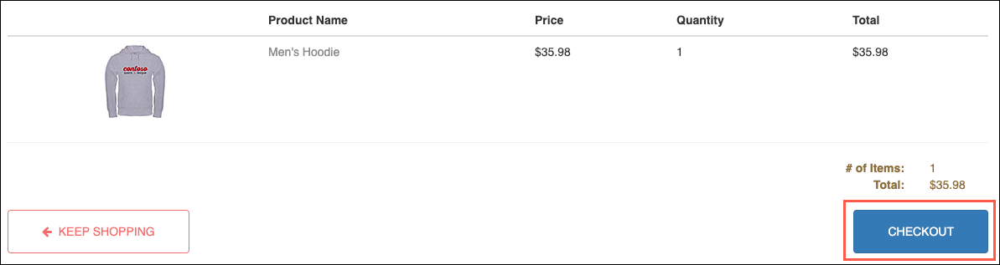

3. On the Checkout page, enter the following:

   - **First Name**: Enter your first name into this field. **Note**: You can accept the default value, but this will make it difficult to locate your order in the Call Center application's order list.
   - **Last Name**: Enter your last name into this field. **Note**: You can accept the default value, but this will make it difficult to locate your order in the Call Center application's order list.
   - **Phone**: Enter your mobile phone number, so you can receive an SMS notification about your order being processed.
   - **Receive SMS Notifications?**: Leave this checked if you want to receive an SMS text message at the number provided when your order is processed. Leaving this checked will allow you to see the functionality implemented using serverless services as part of the effort to improve application functionality through the use of services available in Azure.
   - **IMPORTANT**: Leave the credit card fields set to the default values specified. The credit card number `4111111111111111` is a test number that can be used for testing credit card processing services.

   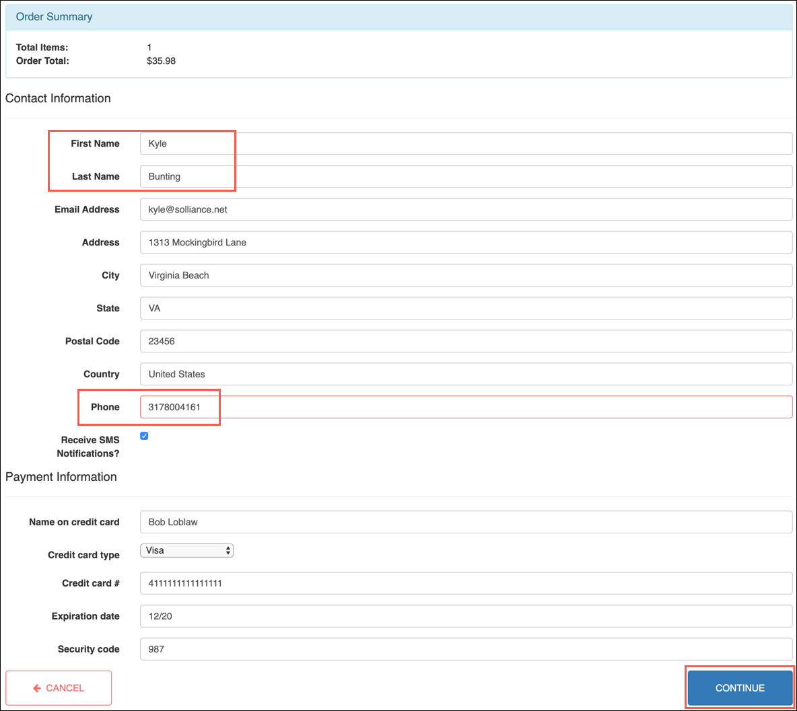

4. Select **Continue**.

5. On the Order Summary page, select **Complete Order**.

   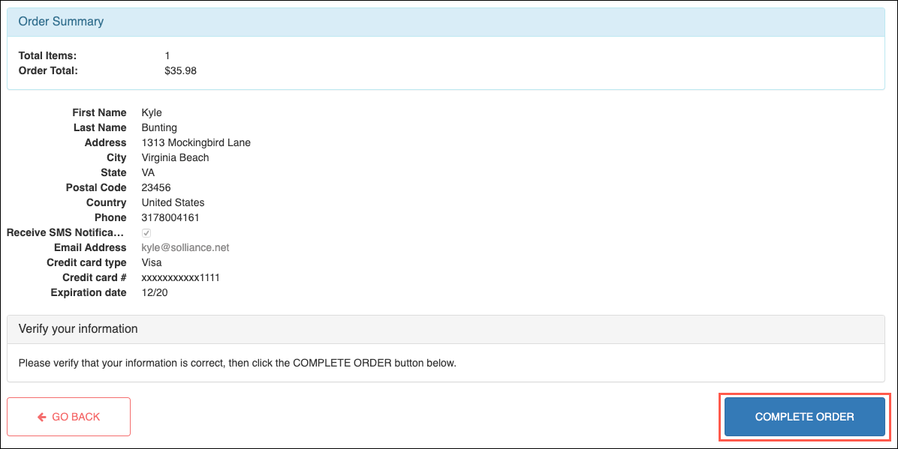

6. Ensure you receive a **Success** message on the order completed page.

   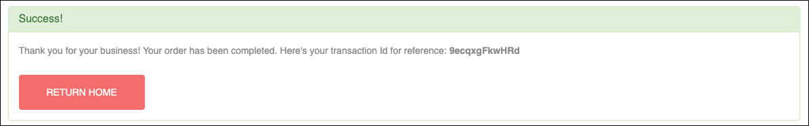

7. If you entered a valid phone number and opted to receive SMS notifications, you should receive an SMS message within a few minutes of placing the order.

   

### Task 5: View orders in the call center app

The Call Center website is running in a Web App and is secured using [Azure Active Directory](https://docs.microsoft.com/en-us/azure/active-directory/fundamentals/active-directory-whatis) (Azure AD). Azure Active Directory (Azure AD) is Microsoft’s cloud-based identity and access management service, which helps your employees sign in and access resources. The Call Center website is an internal application and using Azure AD allows it to run in the cloud and still be accessed securely by internal users only.

In this task, you will log into the Call Center website using a custom-branded login experience.

1. Open a new browser window or tab and navigate to the Contoso Sports Call Center app at <https://csla-admin.azurewebsites.net>.

2. You will be redirected to the Contoso Sport League sign in page, which has been customized with Custom Branding in Azure AD.

   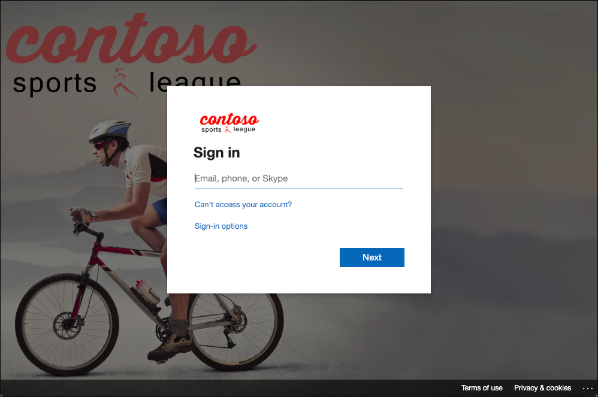

3. Only accounts in the Contoso Sports Azure AD organization are able to login to the Call Center website. On the Sign In page, enter the user account provided to you for this workshop (e.g., `CloudCoreMba-XX@solliancecc.onmicrosoft.com`) and then select **Next**.

4. Enter the password provided to you for the user account above and then select **Sign in**.

5. Select **Yes** if prompted to stay signed in.

6. On the Admin site home page, you will see a list of completed orders. Select **Details** next to your order (or any order if you chose not to enter your name).

   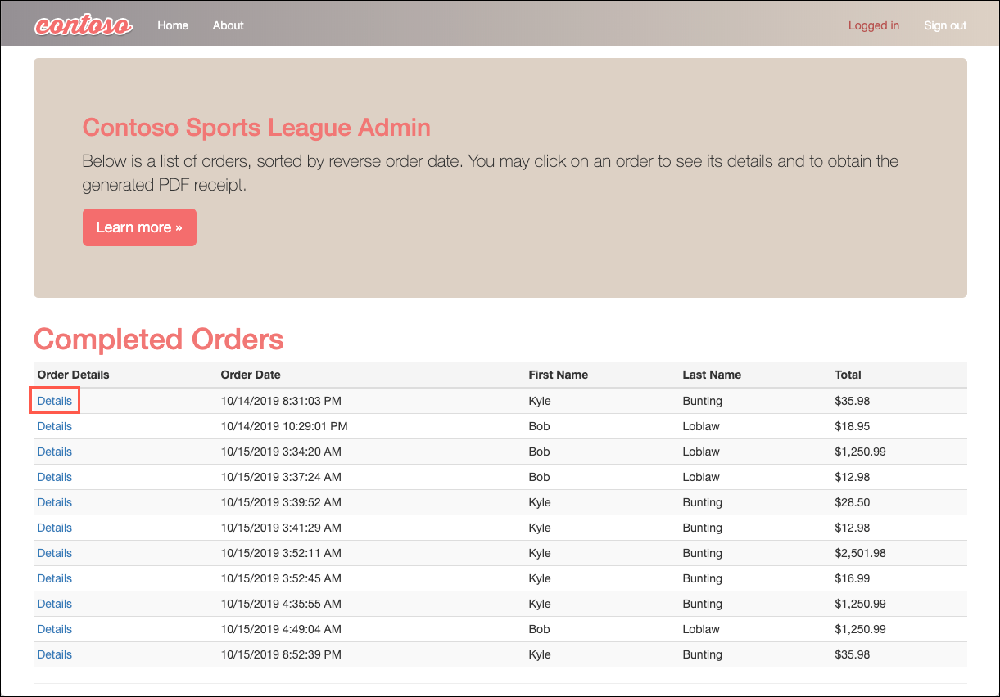

7. Review your order details on the Order Details page. While on the Order Details page, select the **Download receipt** link.

   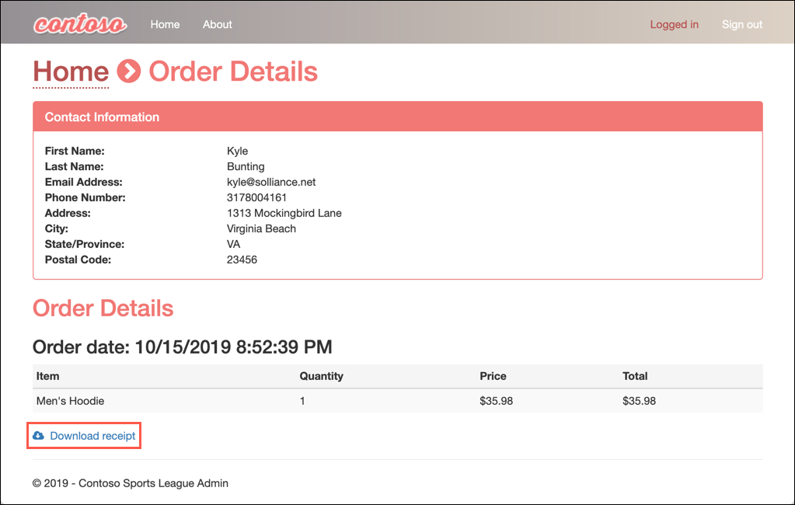

   > **Note**: The receipt PDF documents are generated using serverless compute resources in Azure, including an Azure Storage Queue, an Azure Function and a Logic App. In the exercises below, we take a deeper look into these technologies and how they can be used to simplify and accelerate application development.

### Exercise 1 challenge questions

1. How can using Azure AD (Organizational and B2C) improve the overall customer experience and application security posture?
2. What benefits can be derived from using a read-only database connection for viewing data?

## Exercise 2: Review Azure App Services

Now that you are familiar with the front-end applications, it is time to investigate how the functionality is made available through Azure services. In this exercise, you will log into the [Azure portal](https://portal.azure.com) and look behind the scenes of the e-commerce website and how Azure Key Vault is used to secure application secrets.

### Task 1: Inspect Web App configuration

The Microsoft CSA team has taken care of deploying the Contoso Sports League .NET code to the Web App. Once the application is deployed, it uses values stored in the application settings to connect to the database and other services. In this task, you will review the application settings configuration for the deployed Web App.

1. In a new browser window or tab, navigate to the [Azure portal](https://portal.azure.com).

2. When prompted, log in with the user account and password provided to your for this workshop. This will use the same custom-branded login screen that you used to log into the Call Center website.

3. Once logged in, select **Resource groups** from the left-hand menu, and then select the **cloudcore-mba** resource group from the list.

   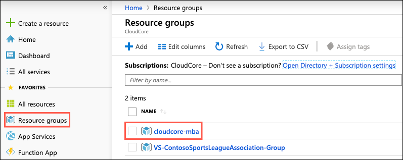

4. Within the resource group, select the **App Service** resource named **csla** from the list.

   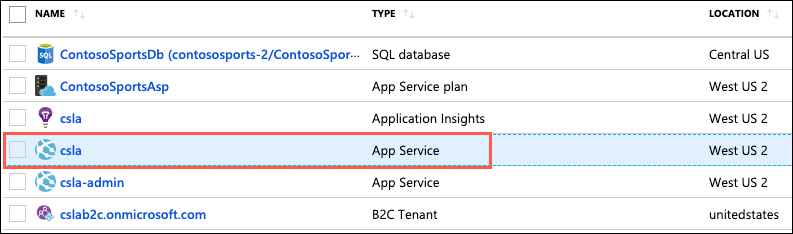

5. On the csla App Service blade, select **Configuration** from the left-hand menu under Settings.

   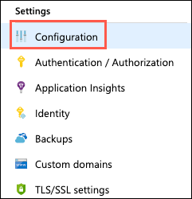

6. Within the Application settings section, you will see a list of the settings configured for the web application. The values of these settings are hidden by default, as they may contain sensitive information, such as passwords and database connection string. To view a setting's value, select the **Show value (eye)** icon before the value.

   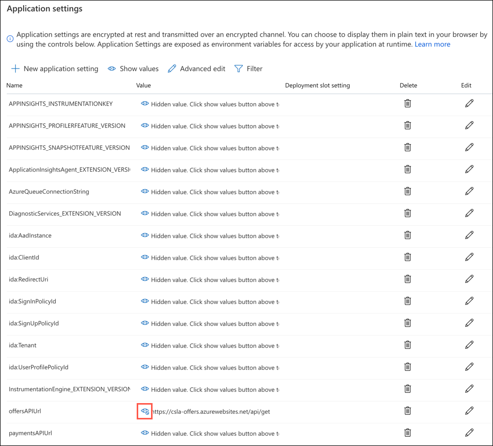

7. Next, scroll down to the Connection strings section, and select the **Edit (pencil)** icon for the **ContosoSportsLeague** connection string.

   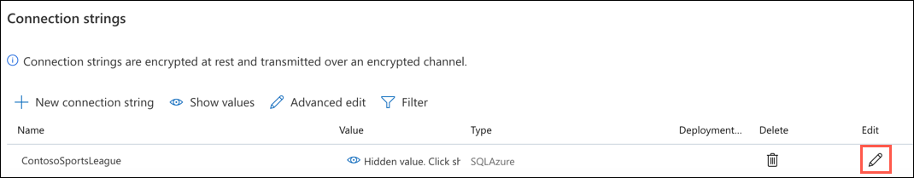

8. Observe the value assigned to the connection string.

   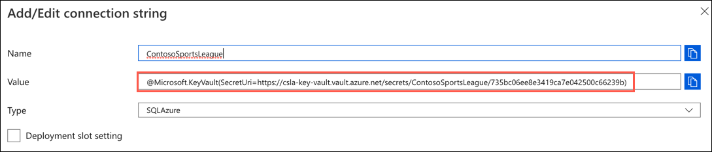

9. Typically, SQL database connection strings have a format similar to the following:

   ```sql
   Server=tcp:{your_server_name}.database.windows.net,1433;Initial Catalog=ContosoSportsDb;Persist Security Info=False;User ID={your_userid};Password={your_password};MultipleActiveResultSets=False;Encrypt=True;TrustServerCertificate=False;Connection Timeout=30;
   ```

10. The value set for the ContosoSportsLeague connection string, however, is:

    ```sql
    @Microsoft.KeyVault(SecretUri=https://csla-key-vault.vault.azure.net/secrets/ContosoSportsLeague/735bc06ee8e3419ca7e042500c66239b)
    ```

11. In this case, the application has been configured to retrieve the connection string from [Azure Key Vault](https://docs.microsoft.com/en-us/azure/key-vault/key-vault-overview).

    > **Note**: Application settings frequently contain sensitive information and secrets. Microsoft Azure provides a tool to protect these secrets, Azure Key Vault. Key Vault provides a way to securely store secrets and access from the App Service configuration blade by using [Key Vault references](https://docs.microsoft.com/en-us/azure/app-service/app-service-key-vault-references). Using Key Vault references, secrets can be stored in Key Vault and added to application configuration settings without the need to write code or make changes to applications. This provides an additional layer of security, as Azure administrators can create the secrets and grant read access to applications, preventing developers from ever needing to access or know the secrets to create applications.

12. Before move on to the next task, let's break down the Key Vault reference value stored in the ContosoSportsLeague connection string setting.

    - The first part, `@Microsoft.KeyVault`, tells the application to use Key Vault references.
    - Within the parentheses, there is a single value, `SecretUri`. This value is obtained from Key Vault, and provides a link to the secret.
    - Breaking down the URI value, you will notice after `/secrets/` that the name of the key is listed. In this case, the secret name is `ContosoSportsLeague`. Remember this value, as you will use it to find the secret within Key Vault in the next task, and then look at the value being protected by Key Vault.

    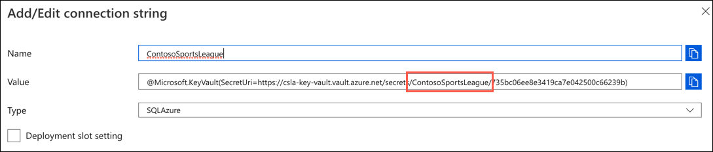

### Task 2: Securing application secrets with Key Vault

Centralizing the storage of application secrets in Azure Key Vault allows for tighter control of their distribution. Key Vault greatly reduces the chances that secrets may be accidentally leaked. When using Key Vault, application developers no longer need to store security information in their application. Not having to store security information in applications eliminates the need to make this information part of the code. For example, an application may need to connect to a database. Instead of storing the connection string in the app's code, you can store it securely in Key Vault. In this task, you will learn more about how Key Vault stores secrets.

1. In the [Azure portal](https://portal.azure.com), select **Resource groups** from the left-hand menu, and then select the **cloudcore-mba** resource group from the list.

   

2. Within the resource group, select the **Key vault** resource named **csla-key-vault** from the list.

   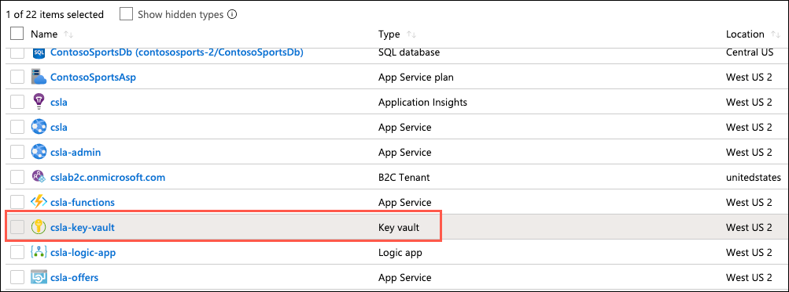

3. On the Key vault blade, select **Secrets** from the left-hand menu under Settings.

   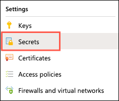

4. **Challenge**: Looking at the list of secrets, can you navigate to the one with the name you extracted from the Key Vault reference at the end of the previous task, and locate the Secret Identifier (URI) and then look at the value of the secret being stored?

   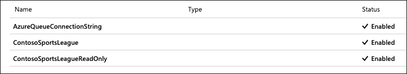

### Exercise 2 challenge questions

1. How does implementing websites and APIs using Azure App Services benefit customers and what impact can it have on their need to manage infrastructure?
2. How can Azure Key Vault help to prevent application secrets from being accidentally leaked by developers into source code repositories?

## Exercise 3: Explore database features

In this exercise, we explore the benefits of using a fully-managed PaaS database in Azure. [Azure SQL Database](https://docs.microsoft.com/en-us/azure/sql-database/sql-database-technical-overview) is a general-purpose relational database, provided as a managed service. It includes built-in high availability, backups, and other common maintenance operations. Microsoft handles all patching and updating of the SQL and operating system code. Customers do not have to manage the underlying infrastructure.

Specifically, you will take a look at [auto-failover groups](https://docs.microsoft.com/en-us/azure/sql-database/sql-database-auto-failover-group) and how they can provide protection from regional outages to ensure continued operation of a database. Used in conjunction with geographically distributed Web and API Apps, auto-failover groups can improve the high-availability of applications deployed to Azure. You will also review some of the security features provided by [SQL Database Advance Data Security](https://docs.microsoft.com/azure/sql-database/sql-database-advanced-data-security) (ADS). ADS provides advanced SQL security capabilities, including functionality for discovering and classifying sensitive data, surfacing and mitigating potential database vulnerabilities, and detecting anomalous activities that could indicate a threat to your database. ADS is enabled at the server level for all databases on the SQL Server.

### Task 1: Inspect auto-failover groups configuration

Auto-failover groups is a SQL Database feature that allows the management of replication and failover of a group of databases on a SQL Database server or all databases in a managed instance to another region. It was designed to simplify deployment and management of geo-replicated databases at scale. In this task, you will navigate to the failover group created for Contoso Sports, and look at the properties associated with it.

1. Open the [Azure portal](https://portal.azure.com) in a new browser window or tab, select **Resource groups** from the left-hand menu, and then select the **cloudcore-mba** resource group from the list.

   

2. Within the resource group, select the **SQL server** resource named **contososports-1** from the list.

   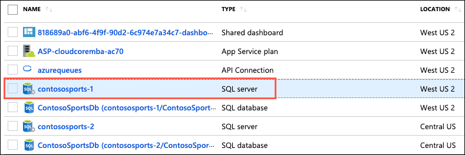

3. On the contososports-1 blade, select **Failover groups** from the left-hand menu under **Settings**.

   

4. On the Failover groups blade, select the **contososports-db** failover group.

   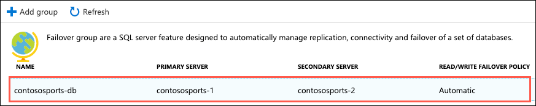

5. The contososports-db failover group blade displayed a map containing the locations of the primary and secondary SQL servers within the failover group, along with a list of the servers, their locations, and roles.

   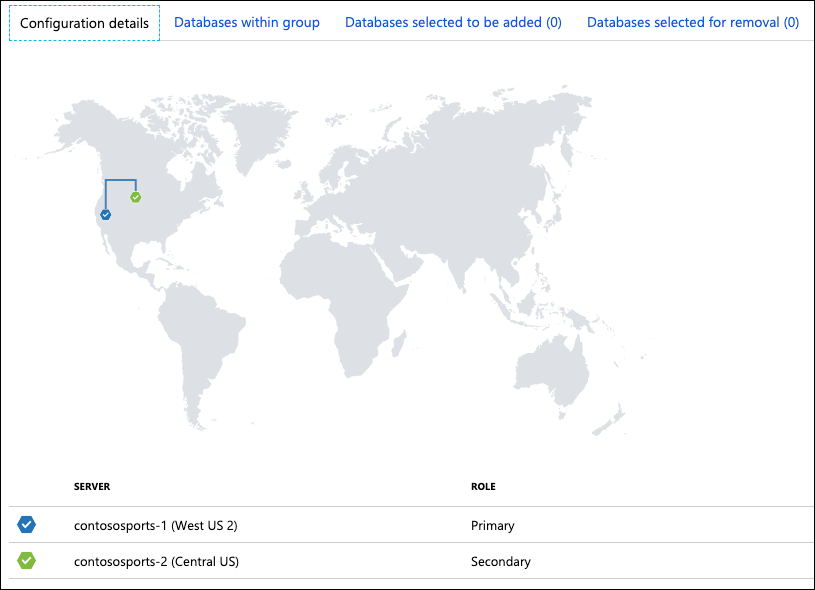

6. Also, note the listener endpoints provided at the bottom of the page.

   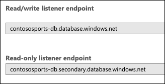

   > The read scale-out functionality used for the Offers API is accomplished by referencing the **read-only listener endpoint** when connecting to the database server. This endpoint points to the server in the secondary role, allowing read-only workloads to hit the database replica, and avoid adding load to the primary read-write server.

7. Selecting the **Databases within group** tab allows you to see the SQL Database that are included in the failover group.

   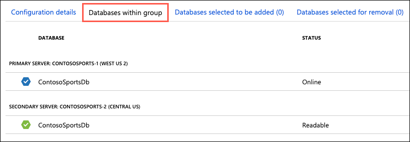

### Task 2: Review database vulnerability assessment

In this task, you will review an assessment report generated by [Advance Data Security](https://docs.microsoft.com/azure/sql-database/sql-database-advanced-data-security) for the `ContosoSportsDb` database. [Vulnerability assessment](https://docs.microsoft.com/en-us/azure/sql-database/sql-vulnerability-assessment) is an easy to configure service for discovering, tracking, and helping with the remediation of potential database vulnerabilities. It provides valuable visibility into the security state of databases, and includes actionable steps to resolve security issues, and enhance database fortifications.

> Using the SQL Vulnerability Assessment is simple to identify and remediate potential database vulnerabilities, allowing you to proactively improve your database security.

1. In the [Azure portal](https://portal.azure.com), select **Resource groups** from the left-hand menu, and then select the **cloudcore-mba** resource group from the list.

   

2. Within the resource group, select the **SQL database** resource named **ContosoSportsDb (contososports-1/ContosoSportsDb)** from the list.

   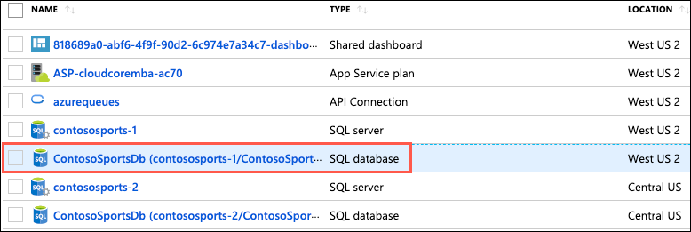

3. On the ContosoSportsDb blade, select **Advanced data security** from the left-hand menu under **Security**.

   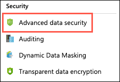

4. On the **Advanced Data Security** blade, select the **Vulnerability Assessment** tile.

   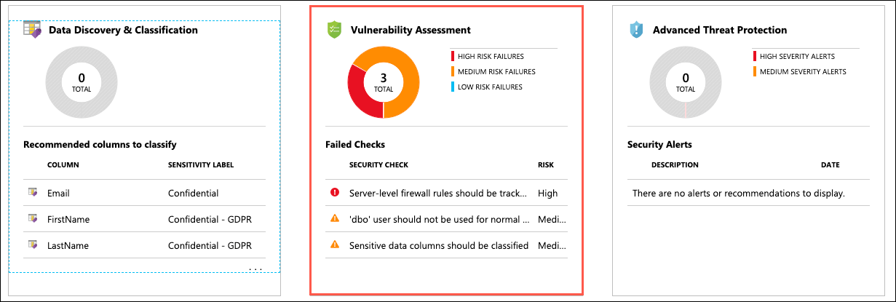

   > The [SQL Vulnerability Assessment service](https://docs.microsoft.com/azure/sql-database/sql-vulnerability-assessment) is a service that provides visibility into your security state, and includes actionable steps to resolve security issues, and enhance your database security.

5. The Vulnerability Assessment dashboard displays details about the number of failing and passing checks, and a breakdown of the risk summary by severity level.

   

6. In the scan results, take a few minutes to browse both the Failed and Passed checks, and review the types of checks that are performed. In the **Failed** the list, locate the security check for **Sensitive data columns should be classified**. This check has an ID of **VA1288**.

   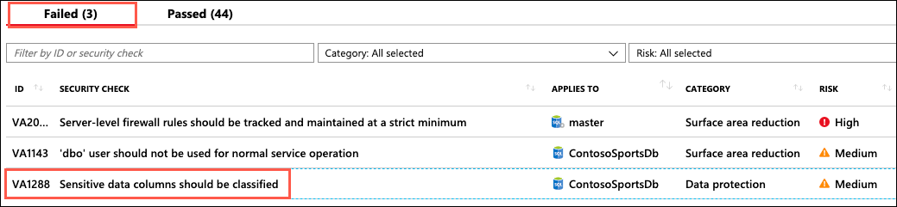

7. Select the **VA1288** finding to view the detailed description.

   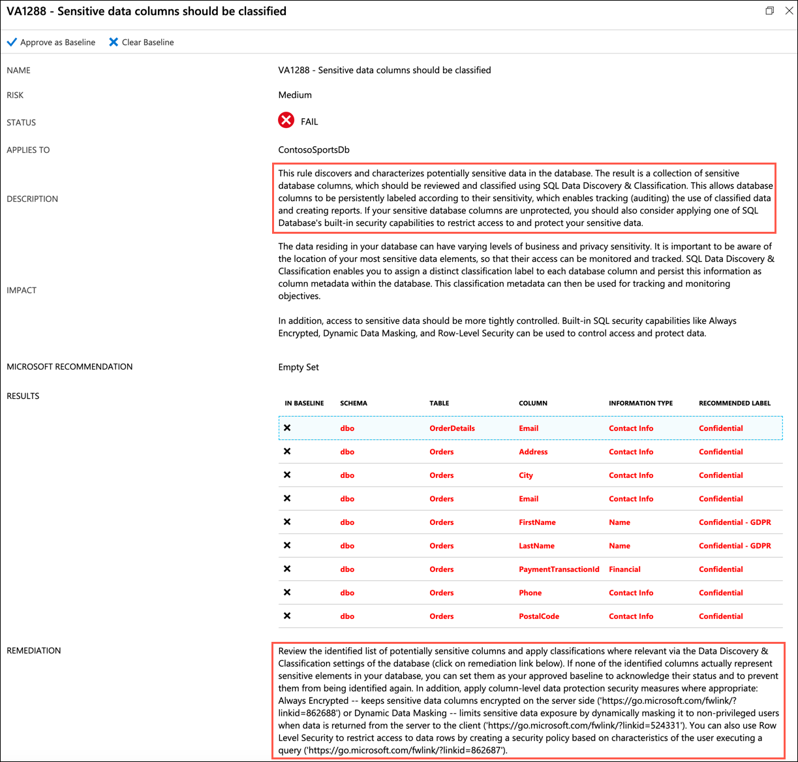

   > The details for each finding provide more insight into the reason for the finding. Of note are the fields describing the finding, the impact of the recommended settings, and details on remediation for the finding.

8. Close the **VA1288** details blade by selecting the X in the upper right-hand corner.

9. Close the Vulnerability Assessment blade by selecting the X in the upper right-hand corner.

### Task 3: Explore Data Discovery and Classification findings

In the previous task, you examined failure **VA1288** in the Vulnerability Assessment findings. In this task, you will look at another **Advanced Data Security** feature available within Azure SQL Database, [SQL Data Discovery & Classification](https://docs.microsoft.com/sql/relational-databases/security/sql-data-discovery-and-classification?view=sql-server-2017). Data Discovery & Classification is the tool that you would use to implement the recommended remediation steps for the **VA1288** finding in the Vulnerability Assessment.

Data Discovery & Classification introduces a new tool built into Azure SQL Database for discovering, classifying, labeling and reporting the sensitive data in databases. It introduces a set of advanced services, forming a new SQL Information Protection paradigm aimed at protecting the data within databases, not just the database. Discovering and classifying the most sensitive data (business, financial, healthcare, etc.) can play a pivotal role in organizational information protection.

1. On the Advanced Data Security blade in the [Azure portal](https://portal.azure.com), select the **Data Discovery & Classification** tile.

    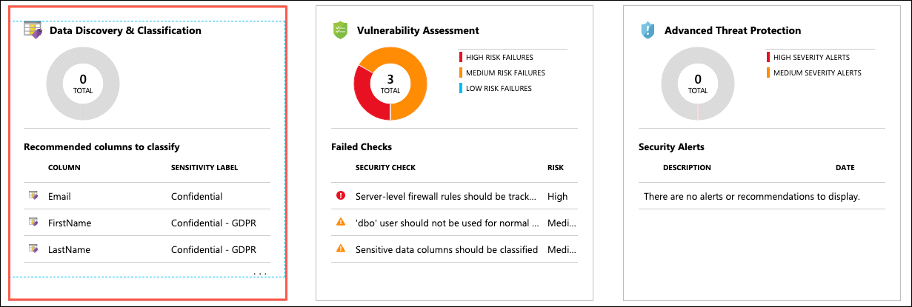

2. The **Overview** tab on the Data Discovery & Classification blade contains a report with a full summary of the database classification state.

    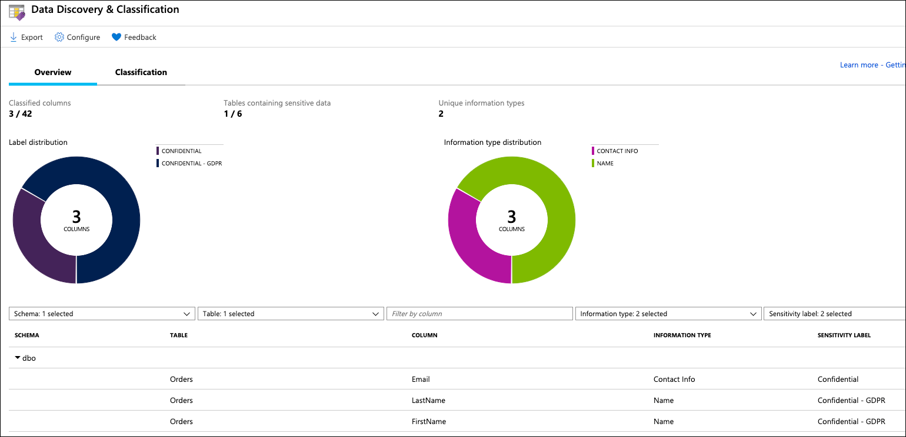

    > This report provides details about the types of data stored in the database and is useful in understanding the appropriate security and protection levels required for those data.

3. Select the info link with the message **We have found 6 columns with classification recommendations** at the top of the report.

    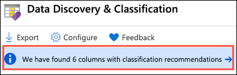

4. Look over the list of recommendations to get a better understanding of the information types and sensitivity classifications that are assigned, based on the built-in settings.

    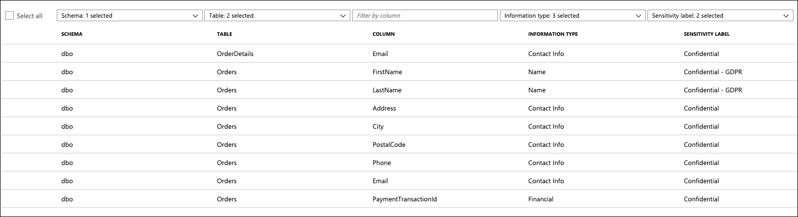

5. To further understand the available built-in classifications, select **+ Add classification** at the top of the Data Discovery & Classification blade.

    

6. Expand the **Information type** field and review the available built-in options you can choose from. You can also add custom labels.

   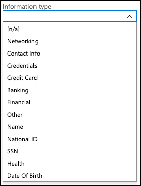

7. Next, expand the **Sensitivity label** field and review the various built-in labels you can choose from. You can also add custom labels, should you desire.

    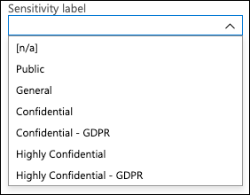

### Exercise 3 Challenge questions

1. How can Data Discovery & Classification be used to ensure companies operating with the European Union are aware of data that might be protected under GDPR (General Data Privacy Regulation)?
2. What is the value proposition provided by automatic failover groups? What would be required for an organization to achieve the same functionality without using a cloud provider?

## Exercise 4: Automating back-end processes with serverless computing

Serverless computing enables developers to build applications faster by eliminating the need for them to manage infrastructure. With serverless applications, the cloud service provider automatically provisions, scales, and manages the infrastructure required to run the code. In understanding the definition of serverless computing, it’s important to note that servers are still running the code. The serverless name comes from the fact that the tasks associated with infrastructure provisioning and management are invisible to the developer.

> Using serverless computing resources enables developers to increase their focus on the business logic and deliver more value to the core of the business. Serverless computing helps teams increase their productivity and bring products to market faster, and it allows organizations to better optimize resources and stay focused on innovation.

### Task 1: Explore the Logic App configuration

Without writing any code, you can automate business processes more easily and quickly when you create and run workflows with Azure Logic Apps. Logic Apps provide a way to simplify and implement scalable integrations and workflows in the cloud. It provides a visual designer to model and automate your process as a series of steps known as a workflow. There are [many connectors](https://docs.microsoft.com/en-us/azure/connectors/apis-list) across the cloud and on-premises to quickly integrate across services and protocols.

The advantages of using Logic Apps include the following:

- Saving time by designing complex processes using easy to understand design tools
- Implementing patterns and workflows seamlessly, that would otherwise be difficult to implement in code
- Getting started quickly from templates
- Customizing your logic app with your own custom APIs, code, and actions
- Connect and synchronize disparate systems across on-premises and the cloud
- Build off of BizTalk server, API Management, Azure Functions, and Azure Service Bus with first-class integration support

1. In the [Azure portal](https://portal.azure.com), select **Resource groups** from the left-hand menu, and then select the **cloudcore-mba** resource group from the list.

   

2. Within the resource group, select the **Logic app** resource named **csla-logic-app** from the list.

   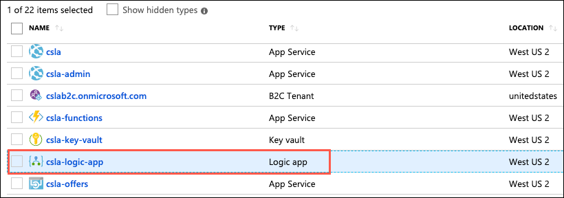

3. On the Logic app blade, select **Logic app designer** from the left-hand menu under Development Tools.

   

4. On the design surface, take a moment to look at the various steps. These steps outline the workflow of the Logic App. You can click on each step to view more information about it, and see the basic configuration entered.

   - **When there are messages in a queue** is an Azure Queues trigger that launches the workflow whenever an item is added to the queue defined within the trigger's settings.
   - **ContosoMakePDF** is an Azure Function action, which makes an HTTP call to an Azure Function that creates and saves a PDF receipt for the order. [Azure Functions](https://docs.microsoft.com/en-us/azure/azure-functions/functions-overview) offer server-free computing in Microsoft Azure.
   - **Parse JSON** handles the response from the Azure Function and makes the returned order object usable by the following steps.
   - **Update row (V2)** is a SQL Server task which updates the order record in the database with the URL to the receipt that was created by the **ContosoMakePDF** step.
   - **Condition** is a conditional step, which will call a Twilio connector to send an SMS message to the phone number provided in the order, if they Receive SMS Notifications check box was checked by the user.
   - **Delete message** removes the message from the queue, so it isn't processed more than once.

   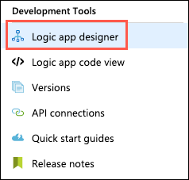

5. At the bottom of the workflow, select **+ New step**.

   

6. In the Choose an action box, select the **All** tab, and scroll down through the list to get a better understanding of the types of actions that can be included in a Logic App.

   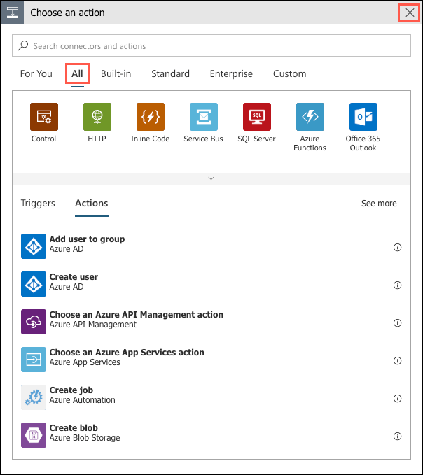

   > Logic Apps provides hundreds of connectors, which provide quick access from Azure Logic Apps to events, data, and actions across other apps, services, systems, protocols, and platforms. By using connectors in your logic apps, you expand the capabilities for your cloud and on-premises apps to perform tasks with the data that you create and already have.

7. When you are done reviewing the actions list, select the **X** in the top corner of the Choose an action box to remove it from the workflow.

### Exercise 4 challenge questions

1. What are the potential benefits of using serverless technologies to extend application functionality in Azure?
2. Describe the benefits organizations can gain with a workflow tool like Logic Apps.

## Additional resources

The table below contains links to the Azure services used throughout this hands-on lab, should you wish to investigate any of the services in more depth.

|    |            |
|----------|-------------|
| **Description** | **Links** |
| SQL firewall | <https://azure.microsoft.com/en-us/documentation/articles/sql-database-configure-firewall-settings/> |
| Deploying a Web App | <https://azure.microsoft.com/en-us/documentation/articles/web-sites-deploy/> |
| Deploying an API app | <https://azure.microsoft.com/en-us/documentation/articles/app-service-dotnet-deploy-api-app/> |
| Accessing an API app from a JavaScript client | <https://azure.microsoft.com/en-us/documentation/articles/app-service-api-javascript-client/> |
| SQL Server auto-failover groups | <https://docs.microsoft.com/en-us/azure/sql-database/sql-database-auto-failover-group> |
| SQL Database Geo-Replication overview | <https://azure.microsoft.com/en-us/documentation/articles/sql-database-geo-replication-overview/> |
| Advanced Data Security for Azure SQL Database | <https://docs.microsoft.com/en-us/azure/sql-database/sql-database-advanced-data-security> |
| What is Azure AD? | <https://azure.microsoft.com/en-us/documentation/articles/active-directory-whatis/> |
| Azure Web Apps authentication | <http://azure.microsoft.com/blog/2014/11/13/azure-websites-authentication-authorization/> |
| View your access and usage reports | <https://msdn.microsoft.com/en-us/library/azure/dn283934.aspx> |
| Custom branding an Azure AD Tenant | <https://msdn.microsoft.com/en-us/library/azure/Dn532270.aspx> |
| Service Principal Authentication | <https://docs.microsoft.com/en-us/azure/app-service-api/app-service-api-dotnet-service-principal-auth> |
| Consumer Site B2C | <https://docs.microsoft.com/en-us/azure/active-directory-b2c/active-directory-b2c-devquickstarts-web-dotnet> |
| Getting Started with Active Directory B2C | <https://azure.microsoft.com/en-us/trial/get-started-active-directory-b2c/> |
| How to Delete an Azure Active Directory | <https://blog.nicholasrogoff.com/2017/01/20/how-to-delete-an-azure-active-directory-add-tenant/> |
| Run performance tests on your app | <http://blogs.msdn.com/b/visualstudioalm/archive/2015/09/15/announcing-public-preview-for-performance-load-testing-of-azure-webapp.aspx> |
| Application Insights Custom Events | <https://azure.microsoft.com/en-us/documentation/articles/app-insights-api-custom-events-metrics/> |
| Enabling Application Insights | <https://azure.microsoft.com/en-us/documentation/articles/app-insights-start-monitoring-app-health-usage/> |
| Detect failures | <https://azure.microsoft.com/en-us/documentation/articles/app-insights-asp-net-exceptions/> |
| Monitor performance problems | <https://azure.microsoft.com/en-us/documentation/articles/app-insights-web-monitor-performance/> |
| Creating a Logic App | <https://azure.microsoft.com/en-us/documentation/articles/app-service-logic-create-a-logic-app/> |
| Logic app connectors | <https://azure.microsoft.com/en-us/documentation/articles/app-service-logic-connectors-list/> |
| Logic Apps Docs | <https://docs.microsoft.com/en-us/azure/logic-apps/logic-apps-what-are-logic-apps> |
| Azure Functions -- create first function | <https://docs.microsoft.com/en-us/azure/azure-functions/functions-create-first-azure-function> |
| Azure Functions docs | <https://docs.microsoft.com/en-us/azure/logic-apps/logic-apps-azure-functions> |
| Azure Key Vault | <https://docs.microsoft.com/en-us/azure/key-vault/key-vault-overview> |
| Application Insights | <https://docs.microsoft.com/en-us/azure/azure-monitor/app/app-insights-overview> |
